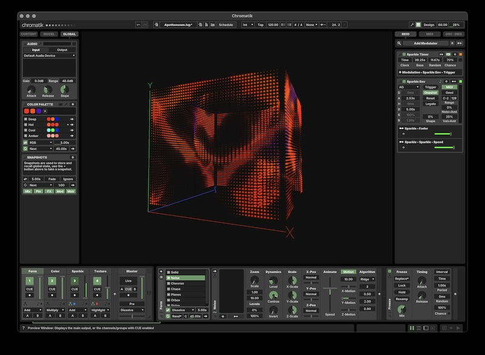

_Apo·then·eum_ (place of divine elevation) is a visual, sonic and haptic instrument designed to transport visitors through participatory immersion.

Comprised of two nested chambers made of back-to-back LED nets (13,280 nodes in all), Apotheneum presents four independent canvases and an immersive sound system for collaborating visual and sound artists to play. Measuring 40&times;40&times;40 feet, Apotheneum's cubic antechamber envelops a thirty-foot cylindrical inner sanctum that opens to the sky and is anchored by a 24-foot pressure-sensing bed from which vantage point our three primary somatic senses are engaged.

This repository contains materials used to Apotheneum's animation engine in the [Chromatik](https://chromatik.co/) Digital Lighting Workstation.

Learn more on the [Apotheneum Wiki &rarr;](https://github.com/Apotheneum/Apotheneum/wiki)

---

### Copyright Notice

Unless otherwise indicated, all contents in this repository are copyright their original authors (as stated in the file or recorded by the version history). Materials here are not under open source license, artworks are the intellecual property of their creators.

---

### Getting Started

This package currently requires macOS on an Apple Silicon machine. Windows instructions will be added in the future.

#### Installing Chromatik

**Chromatik 1.2.2 or later is required.** Earlier releases cannot load this
package: Chromatik 1.2.2 changed the type of the image path parameter used by
the `DeformableImage` pattern, and a build targeting 1.2.2 will fail to link
against 1.2.1 with a `NoSuchFieldError` when a project is opened. See
[issue #41](https://github.com/Apotheneum/Apotheneum/issues/41).

* Download the latest [Chromatik release](https://chromatik.co/download/)
* Register a [Chromatik account](https://chromatik.co/login)
* Coordinate with the Apotheneum team to receive a developer license

Only one Apotheneum package may be installed at a time. If `~/Chromatik/Packages`
contains more than one `apotheneum-*.jar`, Chromatik logs `Ignoring duplicate
class` and may load classes from the stale jar, which reintroduces the error
above. Remove the older jar.

#### Apotheneum Assets

* Download the latest [Apotheneum package](https://github.com/Apotheneum/Apotheneum/releases/download/2026.03.02/apotheneum-0.0.1-SNAPSHOT.jar)
* Open Chromatik, drag-and-drop the Apotheneum file `apotheneum-0.0.1-SNAPSHOT.jar` onto the application window
* From Chromatik, open the example project file `~/Chromatik/Projects/Apotheneum/Apotheneum.lxp`

Need more help?<br />
[Installation Guide &rarr;](https://github.com/Apotheneum/Apotheneum/wiki/Installation-Guide)

Learn how to create animation content.<br />
[Chromatik User Guide &rarr;](https://chromatik.co/guide/)<br />
[Chromatik Developer Guide &rarr;](https://chromatik.co/develop/)

Know the limitations of developing large-scale animation on a computer monitor.<br />
[Simulation Principles &rarr;](https://github.com/Apotheneum/Apotheneum/wiki/Simulation-Principles)



---

### Software Development

Coding experience is neither required nor necessary to build animation content in Chromatik. But for those comfortable with basic Java coding, Chromatik offers an extensible framework for custom animation development.

Learn more by reading the [Chromatik Developer Guide &rarr;](https://chromatik.co/develop/)

#### Development Setup

Install the following tools:

* [Java 21 Temurin](https://adoptium.net/)
* [Maven](https://maven.apache.org/)

The build targets Chromatik `1.2.2` (`<lx.version>` in `pom.xml`) and requires
that version to be resolvable from Maven Central. Until it is published there,
build against a locally installed Chromatik by installing its bundled jar under
the three `com.heronarts` coordinates and overriding the version:

```bash
$ JAR="/Applications/Chromatik.app/Contents/app/glxstudio-1.2.2-SNAPSHOT-jar-with-dependencies.jar"
$ for a in lx glx glxstudio; do
    mvn install:install-file -Dfile="$JAR" -DgroupId=com.heronarts \
      -DartifactId=$a -Dversion=1.2.2-SNAPSHOT -Dpackaging=jar
  done
$ mvn -Dlx.version=1.2.2-SNAPSHOT -Pinstall install
```

Maven can be installed using [Homebrew](https://brew.sh/) via the following command:

```bash
$ brew install maven
```

#### Building and Installing

After developing new animation content, you may install it by running `update.command` or invoking Maven directly:

```bash
$ mvn -Pinstall install
```

This builds the JAR file and copies it to `~/Chromatik/Packages` for automatic loading in Chromatik.

#### Pattern Development

Apotheneum provides specialized base classes for different types of animations:

**For Apotheneum-specific geometry patterns:**
```java
public class MyPattern extends ApotheneumPattern {
    protected void render(double deltaMs) {
        // Access cube and cylinder geometry
        // Use utility methods like copyExterior()
    }
}
```

**For 2D raster-based patterns:**
```java
public class MyRasterPattern extends ApotheneumRasterPattern {
    protected void render(double deltaMs) {
        // Use Graphics2D for 2D rendering
        // Automatic mapping to cube faces
    }
}
```

**For general 3D patterns:**
```java
public class MyGeneralPattern extends LXPattern {
    public void run(double deltaMs) {
        // Standard LX pattern development
    }
}
```

#### Example Patterns

* [`StripePattern.java`](src/main/java/apotheneum/examples/StripePattern.java) - General 3D geometry pattern
* [`RasterOval.java`](src/main/java/apotheneum/examples/RasterOval.java) - 2D raster pattern
* [`Raindrops.java`](src/main/java/apotheneum/mcslee/Raindrops.java) - Apotheneum-specific geometry pattern

#### Physical Structure

The installation consists of:
* **Cube**: 4 faces of 50×45 LED grids (exterior + interior)
* **Cylinder**: 120 columns of 43 LEDs each (exterior + interior)  
* **Doors**: 10×11 LED cutouts affect pixel availability
* **Total**: 13,280 LED nodes

A more general overview of the content package structure is provided in the [LXPackage Template Repository &rarr;](https://github.com/heronarts/LXPackage)
