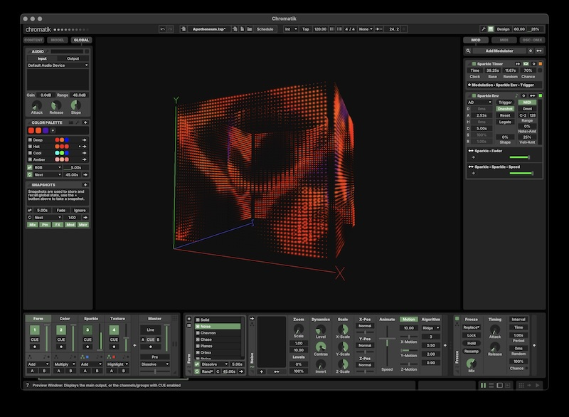

_Apo·then·eum_ (place of divine elevation) is a visual, sonic and haptic instrument designed to help contributing light and sound artists transport visitors through participatory immersion.

This repository contains materials used to Apotheneum's animation engine in the [Chromatik](https://chromatik.co/) Digital Lighting Workstation.

---

### Getting Started

This package currently requires macOS on an Apple Silicon machine. Windows instructions will be added in the future.

#### Installing Chromatik

* Download the [Chromatik preview release for macOS](https://github.com/heronarts/Chromatik/releases/download/1.0.1-SNAPSHOT-2024-03-28/Chromatik-1.0.1-SNAPSHOT-MacOS-Apple-Silicon.zip)
* Register a [Chromatik account](https://chromatik.co/login)
* Authorize Chromatik with your free license

#### Apotheneum Assets

* Clone this repository or [download a ZIP](https://github.com/Apotheneum/Apotheneum/archive/refs/heads/main.zip)
* Double-click to run the Terminal script `bootstrap.command`
* Launch Chromatik and open the project file `~/Chromatik/Projects/Apotheneum/Apotheneum.lxp`



Learn how to create animation content via the [Chromatik User Guide &rarr;](https://chromatik.co/guide/)

---

### Software Development

Coding experience is neither required nor necessary to build animation content in Chromatik. But for those comfortable with basic Java coding, Chromatik offers an extensible framework for custom animation development.

Install the following tools:

* [Java 21 Temurin](https://adoptium.net/)
* [Maven](https://maven.apache.org/)

Maven can be installed using [Homebrew](https://brew.sh/) via the following command:

```
$ brew install maven
````

After developing new animation content, you may install it by running `update.command` or invoking Maven directly:

```
$ mvn install
````

A general overview of how content packages work is provided in the [LXPackage Template Repository &rarr;](https://github.com/heronarts/LXPackage)
