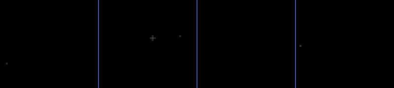

# Rendering a pattern headlessly

Produces visual evidence of what a pattern does without launching Chromatik, so it
works in a worktree, in CI, and in a cloud session. The renderer is
`src/test/java/apotheneum/render/RenderSpike.java` (test scope — it never ships in
the package jar).

## Run it

Render Fireflies (the default):

```bash
mvn -Ptests test-compile exec:exec
```

Render a specific pattern by fully-qualified class name:

```bash
mvn -Ptests -Dpattern=apotheneum.mcslee.CylinderRings test-compile exec:exec
```

Set registered pattern parameters by path with a comma-separated `name=value` list:

```bash
mvn -Ptests test-compile exec:exec \
  -Dpattern=apotheneum.doved.patterns.Raybeam \
  -Dparams=shape=Cone,coneAngle=0.35,radius=0.3
```

Numeric, boolean, discrete-option and enum parameters are supported. Names must match
the pattern's registered parameter paths exactly; option and enum values are
case-insensitive. An unknown name fails with the complete list of available names, and
the renderer logs the resolved values so the invocation remains self-describing.

Add channel effects by fully-qualified class name with a comma-separated list. They are
applied in the order given:

```bash
mvn -Ptests test-compile exec:exec \
  -Dpattern=apotheneum.doved.patterns.Raybeam \
  -Dparams=shape=Cone \
  -Deffects=heronarts.lx.effect.HueSaturationEffect
```

An effects invocation produces both variants in one run: `<surface>.gif` and
`<surface>-contact.png` with every listed effect bypassed, then
`<surface>-effects.gif` and `<surface>-effects-contact.png` with them enabled. Unknown
classes and classes that do not extend `LXEffect` fail before rendering.

The selected class must extend `LXPattern` and have a public constructor accepting
`LX`. `RenderSpike.main` also accepts the class name as its first argument and the
parameter list as its second, then the effect class list as its third when invoked
directly; an absent or blank class name selects Fireflies.

The renderer requires `ffmpeg` on `PATH` to assemble GIFs. This is an agent-only
rendering dependency, not a package build dependency. The command checks for it before
loading LX or rendering any frames and fails immediately with installation guidance if
it is unavailable.

Writes to `target/spike/`: `<surface>.gif` and `<surface>-contact.png` for every
surface that contains a lit usable pixel during the run. For example,
`cube-exterior.gif` and `cube-exterior-contact.png`. The per-frame PNGs used to
assemble each GIF live in a temporary directory and are removed afterwards.

## Judge a viewer-sized column crop

The complete 200-column cube unwrap is useful for checking continuity, but it is a
god's-eye view that no person inside the installation sees. Add a crop when judging
the local shape and motion of a wave, caustic field, or similar pattern:

```bash
mvn -Ptests test-compile exec:exec \
  -Dpattern=apotheneum.doved.patterns.Flood \
  -DcropStart=190 -DcropWidth=60
```

The crop is zero-based, includes exactly `cropWidth` columns, and wraps around the
ring. The example therefore shows cube columns 190..199 followed by 0..49. The same
start and width apply independently to every driven surface; the start is normalized
to that surface's ring width, so it begins at cylinder column 70 on the 120-column
cylinder. Crop width may not exceed the surface ring width. Height is never cropped
or wrapped, and row 0 remains the top.

The full artifacts are still written. Each cropped GIF sits beside its full strip as
`<surface>-crop.gif`; it is an additional review view, not a replacement.

## Pattern-owned animated clips

Use the typed clip facility when parameters must change during a render. A pattern
owns its catalog in its own test-scope driver, so adding Undersea clips and adding
Breaker clips never touches a shared `Clip[]` array. The complete registration API is:

```java
var clips = List.of(new RenderSpike.AnimatedClip<>("rise", Flood::new, 6,
  (pattern, frame, progress, seconds) -> pattern.level.setValue(progress)));
RenderSpike.renderClips(clips,
  new RenderSpike.AnimatedOptions(Path.of("target/flood-renders"), 2, 30));
```

The updater runs immediately before every 60fps engine frame. Its frame number is
1-based, `progress` ranges from `(0, 1]`, and `seconds` includes the frame about to be
rendered. The options specify the output directory, number of engine frames between
written GIF frames, and GIF playback rate. Keep those last two consistent: interval 2
with 30fps playback, or interval 3 with 20fps playback, both preserve real-time motion.

Select the pattern-owned driver and either one named clip or all clips through Maven:

```bash
mvn -Ptests test-compile exec:exec \
  -Drender.mainClass=apotheneum.render.FloodRenderSpike \
  -Dclip=all -DcropStart=190 -DcropWidth=60
```

Each clip gets a fresh pattern instance while all clips share one LX and the real
fixture. Artifacts are grouped as
`target/flood-renders/<clip-name>/<surface>.gif`, with an additional
`<surface>-crop.gif` when a crop is configured. Flood's catalog is the working example;
new pattern drivers only declare their own typed clips and call `renderClips`.

Sample output — Fireflies on the cube exterior, 150 frames at 30fps, rendered with no
Chromatik running:



## Effects and modulators need a host

A pattern renders itself. An effect and a modulator do not — an effect transforms
something, a modulator is a number until something consumes it. Rendering either one
alone shows nothing, so each needs a host pattern and a stated comparison.

**Effects — use `-Deffects=` to render the pair, off and on.** The renderer adds the
listed effects to the channel, disables them for the unsuffixed artifacts, then enables
the same instances for the `-effects` artifacts. It samples the channel's post-effect
mix in both cases. The *difference* is the review artifact; a single frame of an
effected pattern tells a reviewer nothing about what the effect did.

These are two distinct intents. To review a pattern's own logic, omit `-Deffects=` so
the renderer shows only that pattern through the normal channel mix. To review an effect
or see the result of colorization, pass `-Deffects=` and inspect the generated pair.

**Modulators — wire it, then name the target.** Register the modulator, wire it to a
specific parameter of a host pattern via `LXCompoundModulation`, run, and render. Say in
the PR which parameter it drove — "SampleHold → GradientPattern.hue" — because the same
modulator on a different parameter tells a completely different story, and a reviewer
who has to guess the wiring is reviewing their own guess.

A modulator's *correctness* is numeric and belongs in a unit test (see the existing
`SampleHoldTest`, `SelectorTest`, `TempoTapTest`). The render shows something different
and equally necessary: whether the movement is musically useful. Neither replaces the
other.

**Choosing a host.** Prefer a stock LX pattern so the render isn't confounded by a
second thing changing:

- `SolidPattern` — a uniform field. The default choice, because any transformation is
  unambiguous against flat colour.
- `GradientPattern` — when the effect or modulation is position- or hue-dependent and a
  flat field would hide it.

Reach for an Apotheneum pattern as host only when the behaviour under review needs real
geometry, and say why in the PR.

## Which surfaces to render

Apotheneum is **two nested chambers — a cube and a cylinder.** There is no sphere.
Each chamber has an exterior and, when `Apotheneum.hasInterior` is true, an interior.
So there are four renderable surfaces, and which ones matter depends entirely on the
pattern:

| Surface | Unwrapped size | Accessor |
|---|---|---|
| Cube exterior | 200 × 45 (4 faces × 50 columns) | `Apotheneum.cube.exterior` |
| Cube interior | 200 × 45 | `Apotheneum.cube.interior` |
| Cylinder exterior | 120 × 43 (`RING_LENGTH` × `CYLINDER_HEIGHT`) | `Apotheneum.cylinder.exterior` |
| Cylinder interior | 120 × 43 | `Apotheneum.cylinder.interior` |

**One GIF per surface**, named for it — `cube-exterior.gif`, `cylinder-exterior.gif`,
and so on. Not a composite. The two chambers unwrap to different widths (200 vs 120),
so any single image needs gutters, labels, and a decision about alignment, all to
produce something the reader then has to visually separate again. Separate files skip
all of it, and let the reviewer look at one surface at a time.

Render every surface the pattern drives; **the agent then chooses which to attach to
the PR description.** That choice is the point — a pattern whose whole idea is the
interior wants the interior GIF, and attaching all four would bury it.

Skip a surface the pattern never lights. A reviewer seeing an all-black panel
reasonably concludes the pattern is broken, so an empty render is worse than a missing
one. A skipped-surface log includes its peak non-black fraction and, for a spherical
active region exposing normalized `originX/Y/Z`, `radius` and `width`, the nearest
model-point distance and active-region gap. Skip interior surfaces entirely when
`Apotheneum.hasInterior` is false.

Points come from `orientation.point(x, y)` or `column.points[y]`, and **Y=0 is the
top.** Use `surface.available(globalColumn)` for a column's usable height at a door —
never `column.points.length`, which is full height on every column, door or not.

## Frame rate — get this right or the motion lies

**The engine runs at 60fps. The GIF plays at 30.** So write every *other* frame, or
playback is half speed. This is not cosmetic — a pattern reviewed at half speed reads
as calmer and smoother than it will be on the installation, which is exactly the
judgement the render exists to support.

- 5 seconds of real time = 300 engine frames = **150 written frames** at 30fps.
- The first version of this doc got it wrong and produced a 10-second GIF of 5
  seconds of animation. If a render looks unexpectedly languid, check this first.

The renderer assembles each GIF with ffmpeg — no ImageMagick on this machine. Its
per-surface command is equivalent to:

```bash
ffmpeg -y -framerate 30 -start_number 1 \
  -i /tmp/render-frames/cube-exterior/frame-%03d.png \
  -vf "scale=iw:ih:flags=neighbor,split[a][b];[a]palettegen=stats_mode=diff[p];[b][p]paletteuse=dither=none" \
  target/spike/cube-exterior.gif
```

`flags=neighbor` and `dither=none` matter: this is pixel art at LED scale, and smooth
scaling or dithering invents detail that isn't in the render.

## Resolution has a hard ceiling

The cube exterior is 200×45; the cylinder is 120×43. That is all the detail that
exists. The default 4× render is an upscale for legibility — going higher gives bigger
blocks and a bigger file, never more information. Don't reach for a larger scale
expecting a sharper image.

## The six things that break this

Established facts, verified 2026-08-20/21. Don't re-derive them.

1. **The model has 28,320 points, not 13,280.** `AGENTS.md` quotes 13,280 — that is
   *physical LEDs*: exterior only, after door masking. The model carries interior
   surfaces and full logical columns. Any coverage or non-black fraction divides by
   28,320, so expect roughly half the number you'd guess.

2. **The model is hollow.** It contains the cube and cylinder shells, with no points
   filling the volume between them. The nearest point to the normalized centre is about
   .36 away, so a centred sphere with radius .3 and width .05 correctly renders black:
   its active region ends at .35 before reaching an LED.

3. **Output is ON after construction.** `OutputMode.INACTIVE` alone leaves
   `lx.engine.output.enabled` true, and `Apotheneum.lxf` carries real Art-Net
   addresses for the installation. **Disable output explicitly before loading the
   fixture, and assert it stayed false.** This is the one mistake with consequences
   outside your machine.

4. **`Fixtures` is capitalized; this repo's directory is not.** `JsonFixture` resolves
   via `lx.getMediaFile(LX.Media.FIXTURES, "Apotheneum.lxf")` → `<mediaPath>/Fixtures/`.
   The repo stores it at `src/main/resources/fixtures/` (lowercase). macOS is
   case-insensitive so a naive path works locally and fails on Linux CI. Copy the
   `.lxf` into a correctly-cased `Fixtures/` dir inside a temp dir and point
   `LX.Flags.mediaPath` there. Never point mediaPath at `src/main/resources`.

5. **`Apotheneum` holds static state — one `LX` per process.** `initialized`, `lx`,
   `cube`, `cylinder`, and `exists` are all static, and `initialize()` early-returns
   if already initialized, so a second `LX` in the same JVM silently keeps the first
   one's model listener. To render several patterns, build **one** `LX` and swap
   patterns on the channel. This is also why surefire runs `reuseForks=false`.

6. **`addFixture()` only stages regeneration.** Call `structure.beforeEngineRun()`
   before `Apotheneum.initialize(lx)`, or the model isn't there yet and
   `Apotheneum.exists` comes back false.

## Never

- **Never run `mvn -Pinstall install`.** It copies a jar into `~/Chromatik/Packages`,
  which is shared by every worktree and by the live rig. Plain `mvn -Ptests …` only.
- **Never substitute a simplified or synthetic model** to make a render succeed. A
  fake model that renders defeats the entire purpose — the point is to see the pattern
  on the real geometry. If the fixture won't load, stop and report where.

## Reading the output

Check the cheap numbers before spending tokens on an image — non-black fraction, mean
brightness, ms/frame. Most failures (all black, no coverage, NaN, blown frame budget)
show up there for free.

Spend an image when the numbers pass and the question is aesthetic. The five-second
run samples every tenth engine frame, so a contact sheet contains 30 frames. At the
default 4× scale and three columns, cube sheets are 2416×1872 and cylinder sheets are
1456×1792.

Review images get a 2× gamma/brightness lift so dim patterns are judgeable, and blue
markers separate front/right/back/left on the unwrap. **The lift applies to the image
only, never to the statistics** — keep it that way, or the numbers stop meaning
anything.

Rough performance, for spotting a regression rather than for benchmarking: **~300–400 ms**
JVM start plus fixture parse, **~0.22–0.28 ms/frame**. Startup dominates, so a 5-second
render is well under a second of engine time.

## Known gaps

- **No before/after diff.** Comparing two renders of the same pattern across a change
  is done by eye today.
