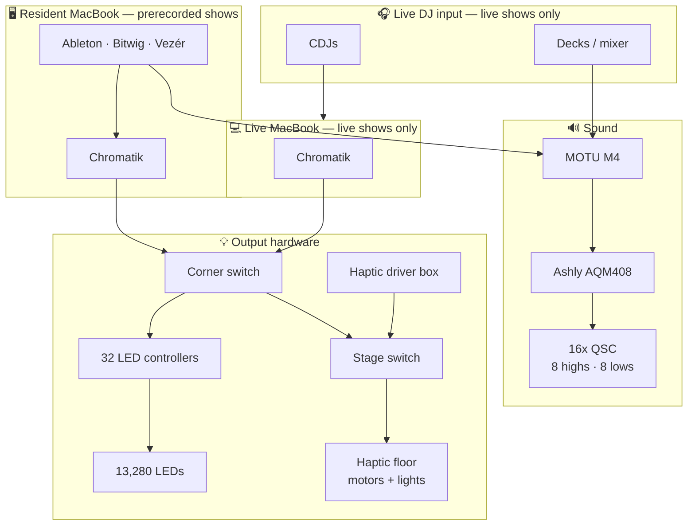

# Apotheneum Infrastructure

How the installation is put together. Open questions live in
[commissioning](commissioning.md).

## Physical layout

**The diagram is the master record of how things connect.** The pages below
follow it. Positions are approximate; connections are not. Detail in
[physical installation](physical.md).

## Two rules

> **Only one Chromatik may output Art-Net.** Both MacBooks can reach the LED
> controllers. Disable output on the resident machine before enabling it on the
> live machine — procedure in [lighting control](lighting-control.md#the-handoff).

> **Never add a second cable between any two switches.** Four unmanaged switches
> are chained. A second path is a loop with nothing to break it, and the
> broadcast storm takes down lights, floor, and control at once. It looks like
> helpfully adding a spare cable.

## Show modes

| | Prerecorded | Live DJ |
|---|---|---|
| Audio source | Software on the resident MacBook | Decks on stage |
| Path to the MOTU | Loopback Audio 1/2 | GEARit XLR-over-Cat5 snake |
| Drives the lights | Resident MacBook | **Live MacBook** — resident's output off |
| MIDI controllers | — | USB to the live MacBook |
| Tempo | Software | CDJs via Beat Link Trigger (not built) |
| Extra cabling | — | Two Cat5/6 runs from stage: one analog audio, one Pro DJ Link |

Both machines are present during a live show; only one drives the lights.

## Pages

- [Physical installation](physical.md) — where things are, cable runs, switches
- [Audio system](audio-system.md) — Loopback → MOTU → Ashly → QSC
- [Lighting control](lighting-control.md) — OSC → Chromatik → Art-Net → LEDs
- [Art-Net destinations](artnet.md) — controller addresses and universes
- [Haptic floor](haptics.md) — driven by its own box, not by Chromatik
- [Commissioning](commissioning.md) — everything still unverified
