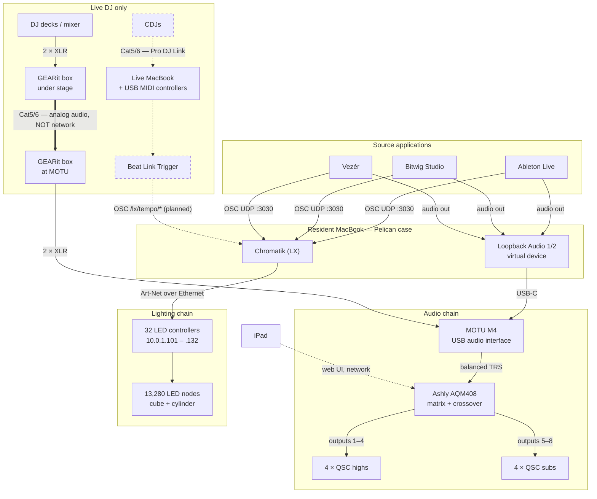

# Apotheneum Infrastructure

**Status: draft.** Items marked **TBD** need to be confirmed on site.

How the show actually runs: what hardware exists, how it is wired, how it is
addressed, and how to bring it up.

## Documents

| Document | Covers |
|---|---|
| [Audio system](audio-system.md) | Loopback → MOTU M4 → Ashly AQM408 → QSC |
| [Lighting control](lighting-control.md) | OSC → Chromatik → Art-Net → LED controllers |

## Signal flow

The same three applications drive both halves of the show. Audio goes out one
path to the PA; OSC goes out another to Chromatik, which renders and pushes
Art-Net to the LEDs. They diverge at the source and never rejoin.

Solid lines are in service today. Dashed lines are control paths or planned
work — the CDJ beat-sync path is not built yet. The heavy line from stage to
MOTU is the one to be careful with: it is Cat5/6 carrying **analog audio**, not
a network link.

## Machines

There is not one computer — there are at least two, with different roles.

| Machine | Presence | Role |
|---|---|---|
| **Resident MacBook** | Always on site, in the Pelican case | Runs prerecorded sets. The default state of the installation. |
| **Live MacBook** | Brought out for live control only | MIDI controllers connect to *this* machine over USB. |

This distinction is the thing most likely to be misunderstood by someone new, so
it belongs at the top: **MIDI controllers do not plug into the resident
machine.** They plug into the live machine, which is only present for live sets.

Open questions this raises, none of them answered yet:

- When the live MacBook is present, which machine runs Chromatik and drives the
  LEDs? Does the resident machine hand off, run in parallel, or shut down?
- Which machine holds the audio chain — is the MOTU M4 re-patched between them,
  or permanently on the resident machine?
- Are the two machines' project files kept in sync, and how?
- Does the live MacBook get a reserved address on the network, or DHCP?

The resident MacBook is the single point of failure for the default show state.

## MIDI control

MIDI controllers connect over **USB to the live MacBook**. Nothing about the
MIDI path is documented yet.

- **TBD:** which controllers, and how many
- **TBD:** what they're mapped to — Chromatik parameters directly, or a DAW that
  then emits OSC?
- **TBD:** are mappings stored in the Chromatik project, and are they in this
  repository or only on that machine?
- **TBD:** USB hub, or direct? Bus power or external?

## Two show modes

The installation runs in one of two configurations, and most of the confusing
details follow from which one is active.

| | Prerecorded | Live DJ |
|---|---|---|
| Audio source | Software on the resident MacBook | Decks on stage |
| Path to MOTU | Loopback Audio 1/2 (virtual) | GEARit XLR-over-Cat5 snake |
| Machines | Resident MacBook only | Both MacBooks |
| MIDI controllers | — | USB to live MacBook |
| Tempo | From the software | CDJs via Beat Link Trigger (planned) |
| Extra cabling | — | Two Cat5/6 runs from stage: one analog audio, one Pro DJ Link |

The two Cat5/6 runs are the easiest thing to mix up: **one carries analog audio
and is not a network cable at all.** See [live DJ
setup](audio-system.md#live-dj-setup).

## Conventions

- **TBD** marks something unverified. Do not delete a TBD by guessing — replace
  it with an observed fact, or leave it.
- Facts read out of this repository (IP addresses, protocols, ports) cite where
  they came from, so they can be re-checked when the code changes.
- Large binaries — vendor PDFs, CAD, photos, BOM spreadsheets — live in the
  shared drive, not here. Link to them from these pages.

## Not yet written

- Network topology: switches, DHCP, VLANs, what the iPad joins
- Power distribution
- Cold-start runbook and shutdown
- Haptics (there is an `Apotheneum-Haptics.lxf` fixture — TBD what drives it)
- Physical rack layout and the contents of the Pelican case
