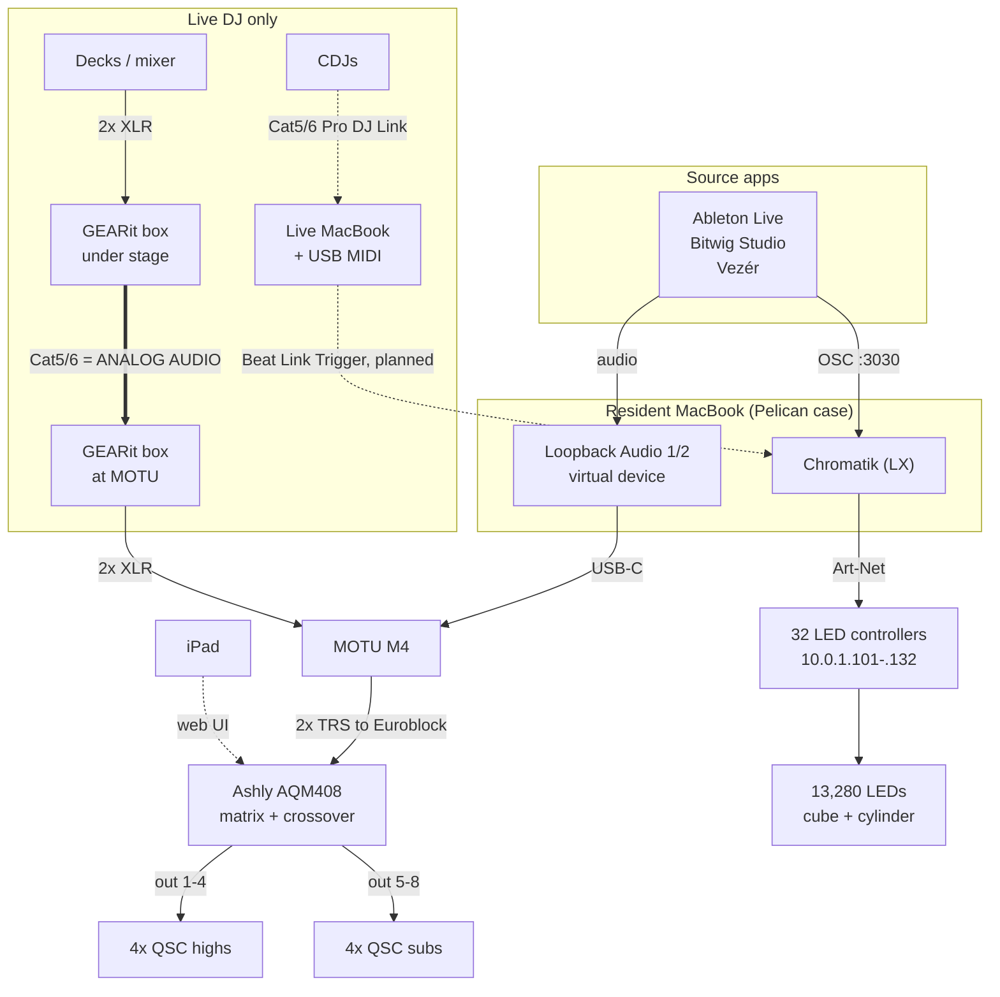

# Apotheneum Infrastructure

**Draft.** **TBD** = unverified. Replace with observed facts; don't guess.

Dashed = control or planned. The heavy line is Cat5/6 carrying **analog audio,
not network**.

## Docs

- [Audio system](audio-system.md) — Loopback → MOTU → Ashly → QSC
- [Lighting control](lighting-control.md) — OSC → Chromatik → Art-Net → LEDs

## Machines

| Machine | Presence | Role |
|---|---|---|
| Resident MacBook | Always, in Pelican case | Prerecorded sets |
| Live MacBook | Live sets only | USB MIDI controllers connect **here**, not to the resident machine |

## Show modes

| | Prerecorded | Live DJ |
|---|---|---|
| Audio source | Software | Decks |
| Path to MOTU | Loopback Audio 1/2 | GEARit XLR-over-Cat5 snake |
| Machines | Resident only | Both |
| Tempo | Software | CDJs via Beat Link Trigger (planned) |
| Extra cabling | — | 2x Cat5/6 from stage: one analog audio, one Pro DJ Link |

## TBD

- Which machine runs Chromatik during live sets; handoff procedure
- Is the MOTU re-patched between machines?
- How project files stay in sync between the two
- Network topology, power distribution, cold-start runbook
- Haptics (`Apotheneum-Haptics.lxf` exists — what drives it?)

Binaries (PDFs, CAD, photos, BOMs) live in the shared drive, linked from here.
