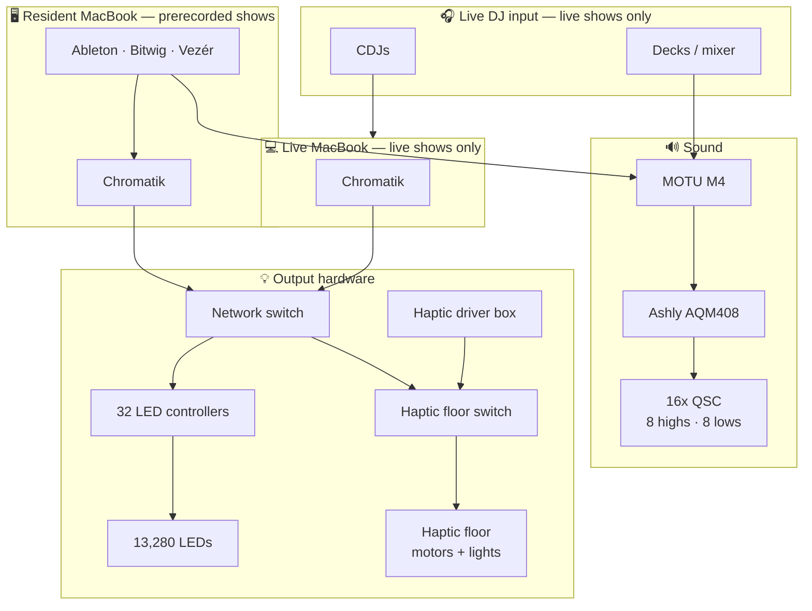

# Apotheneum Infrastructure

**Draft.** **TBD** = unverified. Replace with observed facts; don't guess.

**Reading it:** the two MacBooks are alternatives — never both driving at once.
**Sound** and **Output hardware** are permanent; the **Live MacBook** and **Live
DJ input** boxes only exist during live shows. The haptic floor is on the
network *and* fed by its own driver box — today the box drives it, on an
interval.

Cable types, addresses, and signal detail live in the subsystem pages below —
this diagram is only the shape of the system.

## Physical layout

Where it all actually sits. Cube outside, cylinder inside, stage at centre;
speakers at the four corners; four switches chained from the control position
out to the cube top and the stage.

Positions are a draft — see [physical installation](physical.md) for the detail
and the open questions.

## Three things that will catch you out

> **Only one Chromatik may output at a time.** Both MacBooks run Chromatik and
> both can reach the LED controllers over Art-Net. When bringing the live
> MacBook up, **turn off output on the resident MacBook first** — otherwise two
> instances drive the same controllers and the result is undefined.

> **One USB-C cable carries the resident MacBook's audio *and* network.** A
> failure there kills sound and lights together, which reads as two unrelated
> faults. [Details](physical.md#one-usb-c-cable-to-the-macbook)

> **The Cat5/6 from the stage to the MOTU carries analog audio, not network.**
> No switch goes on either end. A live rig needs a second, separate Cat5/6 run
> for Pro DJ Link — same cable, entirely different job. Label both ends of both.
> [Details](audio-system.md#live-dj)

## Docs

- [Physical installation](physical.md) — where things are, cable runs, the Pelican case
- [Hardware inventory](hardware.md) — master gear list
- [Audio system](audio-system.md) — Loopback → MOTU → Ashly → QSC
- [Lighting control](lighting-control.md) — OSC → Chromatik → Art-Net → LEDs
- [Art-Net destinations](artnet.md) — every controller IP and universe
- [Haptic floor](haptics.md) — standalone, not driven by Chromatik today

## Machines

| | Resident MacBook | Live MacBook |
|---|---|---|
| Presence | Always — sits on top of the MOTU Pelican case | Live sets only |
| Chromatik | Yes | Yes |
| Loopback | Yes | **No** |
| Art-Net to LEDs | Yes — **off during live sets** | Yes — live sets only |
| Connection to the system | Ethernet + USB to MOTU | **Ethernet only** — no MOTU, no Ashly |
| USB MIDI controllers | — | Yes |
| Audio to the PA | Yes, via Loopback → MOTU | No |

**Handoff:** disable Art-Net output on the resident machine before enabling it on
the live machine. Never both.

## Show modes

| | Prerecorded | Live DJ |
|---|---|---|
| Audio source | Software | Decks |
| Path to MOTU | Loopback Audio 1/2 | GEARit XLR-over-Cat5 snake |
| Machines | Resident only | Both |
| Tempo | Software | CDJs via Beat Link Trigger (planned) |
| Extra cabling | — | 2x Cat5/6 from stage: one analog audio, one Pro DJ Link |

## TBD

- Exact handoff steps — where in Chromatik output is disabled, and how we verify
  only one instance is driving the LEDs
- How project files stay in sync between the two machines
- The live MacBook's address on `10.0.1.0/24`
- Network topology, power distribution, cold-start runbook

Binaries (PDFs, CAD, photos, BOMs) live in the shared drive, linked from here.
