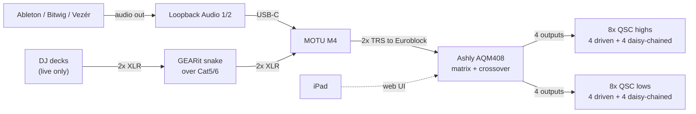

# Audio System

**Draft.** **TBD** = unverified.



Crossover happens in the AQM408, not the amps. Chromatik takes **no audio** —
its only input is OSC. See [lighting control](lighting-control.md).

## Loopback

All three apps output to `Loopback Audio 1/2`, never to the MOTU directly.

**Why:** a DAW saves its output device by name. Set it to `MOTU M4` and the
project breaks at home; set it to a home interface and it breaks on the rig.
`Loopback Audio` exists on every machine, so one setting works in both places.
The MOTU is named exactly once — where Loopback hands off to hardware.

**Don't "simplify" this by pointing DAWs at the M4 directly.** The indirection is
the point.

- Everyone building sets needs Loopback installed, device name left at default.
- Those without it get their output set manually at setup — re-check it every
  time they return.
- `1/2` is a shared convention; the device has three stereo pairs.

Confirmed on a dev Mac: Rogue Amoeba, 6-in/6-out, 48 kHz, transport Virtual.

```bash
system_profiler SPAudioDataType | grep -A 8 "Loopback Audio"
```

**TBD:** confirm on the show MacBook. **TBD:** how Loopback reaches the M4 —
monitors (likely) or a pass-through app. This is the one binding point to the
hardware. **TBD:** are apps ever run simultaneously? Loopback sums them.
**TBD:** startup order, and how we notice if audio goes to the wrong device.

## Live DJ

Two GEARit 4-channel XLR-over-Cat5/Cat6 boxes — one under the stage, one at the
MOTU — joined by one Ethernet cable. We use 2 of 4 channels: stereo into MOTU
inputs 1–2, which are the combo XLR/TRS jacks, so no adapters.

> **That Ethernet cable carries analog audio, not network data.** No switch on
> either end. A live set also needs a *second, separate* Cat5/6 run from stage
> to the live laptop for Pro DJ Link. Label both ends of both.

The live laptop needs a **second Ethernet port** (USB adapter): one interface for
CDJs, one for the LED network.

**TBD:** which mixer output feeds the snake. **TBD:** gain staging vs. software
playback — deck output is hotter, so probably a separate AQM408 preset.
**TBD:** cable lengths; permanent or per-show.

## MOTU M4

Bus-powered, class-compliant — no driver needed. Routing is hardware only, no
mixer app.

| Control | Does |
|---|---|
| Gain (per input) | Input trim |
| 48V | Not needed for line-level decks — leave off |
| MON | Direct hardware monitoring. Inputs 1–2 separate; 3–4 shared. Hold to link a pair |
| INPUT/PLAYBACK | Blends direct input against computer playback |
| MONITOR / PHONES | Output and headphone level |

**For a live DJ, use direct monitoring (MON).** Input routes to output inside the
interface — zero latency, and audio survives a software crash. Nothing
downstream needs the computer to see the audio, so there's no reason to route
through software.

Watch the **INPUT/PLAYBACK** knob: fully at PLAYBACK, direct monitoring is
silent regardless of MON. Nothing on screen shows its position.

**TBD:** photograph the front panel in both modes to record knob positions.
**TBD:** does direct monitoring reach line outs 3–4, or mains only?

## MOTU → Ashly

**This cable exists and is in service.**

| | MOTU M4 out | AQM408 in |
|---|---|---|
| Connector | 1/4" TRS, tip hot | 3-pin Euroblock, `+ – G` |
| Max level | +16 dBu | +21 dBu |

Wiring: tip → `+`, ring → `–`, sleeve → `G`. The M4 tops out 5 dB below the
Ashly's ceiling, so there's headroom and no pad is needed.

**TBD:** photograph both ends and record type/length, so a spare can be ordered
before it fails. A replacement would be a 1/4" TRS-to-bare-wire pigtail —
Euroblock plugs ship with the AQM408.

## Ashly AQM408

1RU, 100–240 VAC. Four Euroblock inputs, eight Euroblock outputs, all post-DSP,
full 8-mixer matrix. DSP per channel: crossover, HPF/LPF, parametric and graphic
EQ, FIR, compressor/limiter, brick wall limiter, gate, delay, autoleveler,
ducking, signal generator.

**Routing:** stereo in, distributed across eight outputs. Two layouts —
**left/right** (conventional) or **criss-cross** (L and R alternate around the
space, less directional). Both are matrix config, not a re-patch.

### Speaker topology

**8 lows + 8 highs across 4 corners**, driven from 8 Ashly outputs. Each corner
gets two Ashly outputs — one to a low, one to a high. The second low and high in
that corner **daisy-chain off the first** using the QSC loop-thru.

```text
Per corner:
  AQM408 out ──▶ high 1 ──thru──▶ high 2
  AQM408 out ──▶ low 1  ──thru──▶ low 2
```

| | Count | Fed by |
|---|---|---|
| Ashly outputs | 8 | 4 to highs (one per corner), 4 to lows |
| Highs | 8 | 4 driven directly, 4 daisy-chained |
| Lows | 8 | 4 driven directly, 4 daisy-chained |

The daisy chain is **line-level thru on the QSC boxes**, so it costs no
amplifier headroom and doesn't change impedance — the second box in each chain
gets the same signal, not a split one.

Crossover stays in the AQM408 and is still per-driver: each corner's high and
low arrive on separate outputs, so they can be filtered independently.

**TBD:** which Ashly output maps to which corner, for highs and lows.
**TBD:** output-to-position mapping under criss-cross vs. left/right; save both
as presets. **TBD:** default layout and why. **TBD:** crossover point and slope,
limiter settings, delay/alignment.

### iPad control

Built-in web server — no app to install. Chrome, Edge, Safari; 1024×768 min, 10"
recommended. RJ-45 to the same network as the iPad.

- Default IP is automatic (DHCP → link-local). Also answers at
  `http://AQM408_<MAC>.local/`
- Factory login `admin` / `secret` — **must be changed**. Roles: admin, guest
  admin, operator, view-only
- **No power switch** — software only, or pull AC
- Rear reset switch: *admin reset* (restores password, keeps presets, reverts to
  automatic IP) or *factory default* (erases everything)

**TBD:** static IP or DHCP reservation, and the address. An automatic address can
change after a reboot and silently break the iPad's bookmark. **TBD:** record the
MAC. **TBD:** rack position; is it near the Pelican case?

## Open

1. QSC models for the highs and the lows
2. Gain structure end to end, and where the system limit is set
3. Known-good AQM408 preset, exported and backed up to the shared drive

## References

- [AQM408 product page](https://ashly.com/processor-card/aqm408/) ·
  [manual (PDF)](https://ashly.com/wp-content/uploads/2024/06/AQM408_manual_r4.pdf)
