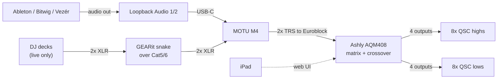

# Audio System



Crossover happens in the AQM408, not the amps. Chromatik takes no audio — its
only input is OSC. Open questions live in [commissioning](commissioning.md).

## Loopback

All three apps output to `Loopback Audio 1/2`, never to the MOTU directly.

**Why:** a DAW saves its output device by name. Set it to `MOTU M4` and the
project breaks at home; set it to a home interface and it breaks on the rig.
`Loopback Audio` exists on every machine, so one setting works in both places.
The MOTU is named exactly once — where Loopback hands off to hardware.

**Do not "simplify" this by pointing DAWs at the M4 directly.** The indirection
is the point.

- Everyone building sets needs Loopback installed, device name left at default.
- Those without it get their output set manually at setup, and it needs
  re-checking every time they return.
- `1/2` is a shared convention; the device has three stereo pairs.

> **Unresolved:** how the Loopback stream actually reaches the M4 — a monitor on
> the virtual device, or a pass-through app. This is the one place the MOTU is
> named, so it needs confirming before the chain above can be called documented.

## Live DJ

Two GEARit 4-channel XLR-over-Cat5/Cat6 boxes — one under the stage, one at the
control position — joined by one Ethernet cable. Two of four channels are used:
stereo into MOTU inputs 1–2, the combo XLR/TRS jacks, so no adapters.

> **That Ethernet cable carries analog audio, not network data.** No switch goes
> on either end. A live set also needs a second, separate Cat5/6 run from the
> stage for Pro DJ Link — same cable, different job. Label both ends of both.

The live MacBook needs a second Ethernet port for the CDJ network, keeping it off
the Art-Net segment.

## MOTU M4

Bus-powered and class-compliant — no driver needed. Routing is hardware only;
there is no mixer app.

| Control | Does |
|---|---|
| Gain (per input) | Input trim |
| 48V | Not needed for line-level decks — leave off |
| MON | Direct hardware monitoring. Inputs 1–2 separate, 3–4 shared. Hold to link a pair |
| INPUT/PLAYBACK | Blends direct input against computer playback |
| MONITOR / PHONES | Output and headphone level |

**For a live DJ, use direct monitoring (MON).** The input routes to the output
inside the interface — zero latency, and audio survives a software crash. Nothing
downstream needs the computer to see the audio.

**Watch the INPUT/PLAYBACK knob.** Fully at PLAYBACK, direct monitoring is silent
regardless of MON, and nothing on screen shows the knob's position.

## MOTU → Ashly

This cable exists and is in service. Tip → `+`, ring → `–`, sleeve → `G`.

| | MOTU M4 out | AQM408 in |
|---|---|---|
| Connector | 1/4" TRS, tip hot | 3-pin Euroblock, `+ – G` |
| Max level | +16 dBu | +21 dBu |

The M4 tops out 5 dB below the Ashly's ceiling, so no pad is needed. A
replacement would be a 1/4" TRS-to-bare-wire pigtail; Euroblock plugs ship with
the AQM408. Note that the [Ashly's connectors are enclosed](physical.md#the-ashlys-connectors-are-not-reachable).

## Ashly AQM408

1RU, four Euroblock inputs, eight Euroblock outputs, all post-DSP, full 8-mixer
matrix. Feature list in the [manual](https://ashly.com/wp-content/uploads/2024/06/AQM408_manual_r4.pdf).

**Routing:** stereo in, distributed across eight outputs. Two layouts —
**left/right** (conventional) or **criss-cross** (L and R alternate around the
space, less directional). Both are matrix configuration, not a re-patch.

### Speaker topology

8 lows and 8 highs across 4 corners, from 8 Ashly outputs.

```text
Per corner:
  AQM408 out ──▶ high 1 ──thru──▶ high 2
  AQM408 out ──▶ low 1  ──thru──▶ low 2
```

The second box in each pair daisy-chains off the first via QSC line-level
loop-thru, so it costs no amplifier headroom and does not change impedance.
Crossover stays per-driver: each corner's high and low arrive on separate
outputs.

### iPad control

The AQM408 serves its own web UI — no app to install. Chrome, Edge, or Safari;
1024×768 minimum, 10" recommended. Connect its RJ-45 to the same network as the
iPad.

- Default IP is automatic (DHCP → link-local). It also answers at
  `http://AQM408_<MAC>.local/`. An automatic address can change after a reboot
  and silently break the iPad's bookmark — assign a static IP or reservation.
- Factory credentials are in the vendor manual and **must be changed**. Store the
  real ones in the crew password manager, not here. Roles: admin, guest admin,
  operator, view-only.
- **No power switch** — software only, or pull AC.
- Rear reset switch: *admin reset* restores the password and keeps presets but
  reverts to automatic IP; *factory default* erases everything.
