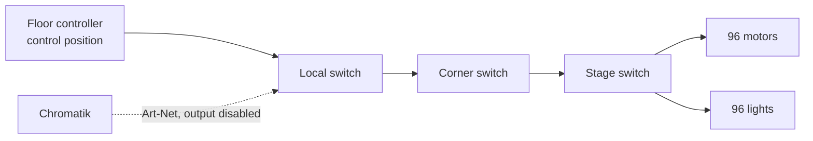

# Haptic Floor

96 motors and 96 lights, paired one-to-one across 6 triangles of 16 positions.
Channel map in [Art-Net destinations](artnet.md#haptic-floor).

## How it is driven today

**Not by Chromatik.** A floor controller at the control position drives the floor
on a fixed interval, unsynchronised to audio, lighting, or show state.

Everything reaches the floor over the network, via the stage switch — see
[four switches](physical.md#four-switches-chained). The floor controller and
Chromatik sit on the same network and address the same hardware.

## The dormant Chromatik path

A complete Art-Net path already exists in the repository, switched off.

| | |
|---|---|
| Fixture | `Apotheneum-Haptics.lxf` |
| Host | `10.0.1.201` |
| Output enabled | **`false` by default** |
| Pattern | `ApotheneumMotors` — `Level` 1–255, momentary `Brake` |

> **Do not enable Chromatik's haptic output until the interaction with the floor
> controller is understood.** Both would be addressing the same hardware over the
> same network at the same time. Whether one wins, they alternate, or they fight
> is unknown, and the obvious way to find out is also the way to find out the
> hard way. The floor controller may need to be physically disconnected first.

## Choosing

Two options, and the choice should be recorded once made:

1. **Keep the floor controller.** Independent of Chromatik, survives a crash, no
   synchronisation with the show.
2. **Drive from Chromatik.** Haptics become part of the composition, with
   per-motor control and braking, and the lights sync with the rest of the show.
   Adds the floor to what breaks when the Mac does.

Option 2 is more attractive than it first looks, because the floor is not motors
alone — the 96 lights are exactly the kind of thing Chromatik is already good at.
