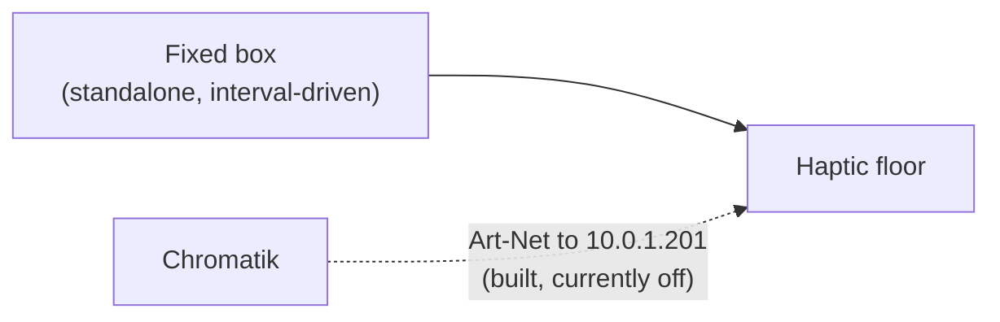

# Haptic Floor

**Draft.** **TBD** = unverified.

## Current state

**The MacBook does not drive the haptic floor.** A standalone box drives it on a
fixed interval, independent of Chromatik and of everything else in this
documentation. It is not synchronised to audio, lighting, or show state.

**TBD:** what the box is — make, model, or whether it's custom.
**TBD:** what interval it runs, and how that's configured or changed.
**TBD:** where it is physically, and how it's powered.
**TBD:** who built it and who can service it.

## The dormant Chromatik path

A full Art-Net path from Chromatik to the haptics already exists in this
repository — it is simply not enabled.

| | |
|---|---|
| Fixture | `src/main/resources/fixtures/Apotheneum-Haptics.lxf` |
| Host | `10.0.1.201` (default) |
| Protocol | Art-Net, `byteOrder: "w"` (single channel per motor) |
| Structure | 6 × `Apotheneum-Haptic-Triangle`, rolled `-60° × instance`, 16 channels apart |
| Output enabled | **`false` by default** |

There is also a pattern for it: `ApotheneumMotors`
(`src/main/java/apotheneum/core/ApotheneumMotors.java`) — "Generates haptic
motor movement with braking function", with a `Level` parameter (1–255) and a
momentary `Brake` that actively brakes the motors.

So switching the floor from interval-driven to show-driven is, on the software
side, mostly a matter of enabling output and running the pattern.

**TBD:** why it isn't used today — was it tried and reverted, never commissioned,
or is the fixed box a deliberate fallback?
**TBD:** does `10.0.1.201` correspond to real hardware currently on the network,
or is it aspirational?
**TBD:** can both drivers coexist, or does enabling Chromatik output require
physically disconnecting the box?

## Decision to make

Two options, and this should be recorded once chosen:

1. **Keep the standalone box.** Simple, independent, survives a Chromatik crash.
   No synchronisation with the show.
2. **Drive from Chromatik.** Haptics become part of the composition, with per-
   motor control and braking. Adds the floor to what breaks when the Mac does.

**TBD:** which, and why.
