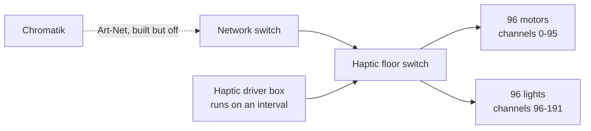

# Haptic Floor

**Draft.** **TBD** = unverified.

## Current state

**The MacBook does not drive the haptic floor.** A driver box runs it on a fixed
interval, not synchronised to audio, lighting, or show state.

The floor has **its own network switch**, which the motors and lights both hang
off. The main system switch reaches it directly — not via the driver box — so
the dormant Chromatik path isn't a wiring project: the route already exists and
is simply switched off. Two things can address the floor.

**Inferred:** that the driver box also attaches to the haptic floor switch
rather than wiring to the motors directly. **TBD** — confirm.

**TBD:** what the box is — make, model, or whether it's custom.
**TBD:** what interval it runs, and how that's configured or changed.
**TBD:** where it is physically, and how it's powered.
**TBD:** who built it and who can service it.

## The dormant Chromatik path

A full Art-Net path from Chromatik to the haptics already exists in this
repository — it is simply not enabled.

| | |
|---|---|
| Fixture | `src/main/resources/fixtures/Apotheneum-Haptics.lxf` |
| Host | `10.0.1.201` (default) |
| Protocol | Art-Net, `byteOrder: "w"` (single channel per motor) |
| Structure | 6 × `Apotheneum-Haptic-Triangle`, rolled `-60° × instance` |
| Per triangle | 16 positions, each with a **motor** and a **light** |
| Channels | Motors 0–95, lights 96–191 (same layout, offset 96) |
| Output enabled | **`false` by default** |

The floor is not motors alone — each position pairs a motor with a light, as
separate `hapticMotors` and `hapticLights` component groups. Full channel map in
[Art-Net destinations](artnet.md). There is a UI for the lights:
`src/main/java/apotheneum/ui/UIApotheneumFloorLights.java`.

There is also a pattern for it: `ApotheneumMotors`
(`src/main/java/apotheneum/core/ApotheneumMotors.java`) — "Generates haptic
motor movement with braking function", with a `Level` parameter (1–255) and a
momentary `Brake` that actively brakes the motors.

So switching the floor from interval-driven to show-driven is, on the software
side, mostly a matter of enabling output and running the pattern.

**TBD:** why it isn't used today — was it tried and reverted, never commissioned,
or is the fixed box a deliberate fallback?
**TBD:** confirm `10.0.1.201` is the floor's own address on the switch, and that
it matches the fixture.
**TBD:** what happens if the driver box and Chromatik drive the floor at the
same time — does one win, or do they fight? This is the same class of problem as
two Chromatiks on the LEDs, and needs an answer before enabling output.
**TBD:** can both drivers coexist, or does enabling Chromatik output require
physically disconnecting the box?

## Decision to make

Two options, and this should be recorded once chosen:

1. **Keep the standalone box.** Simple, independent, survives a Chromatik crash.
   No synchronisation with the show.
2. **Drive from Chromatik.** Haptics become part of the composition, with per-
   motor control and braking. Adds the floor to what breaks when the Mac does.

**TBD:** which, and why.
