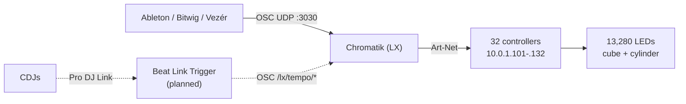

# Lighting Control

**Draft.** **TBD** = unverified.

All three apps send OSC; Chromatik is the only destination. **Chromatik receives
no audio** — there are no audio-reactive patterns.

## OSC in

| Setting | Value |
|---|---|
| Receive host | `0.0.0.0` |
| Receive port | `3030` |
| Receive active | `false` in `Apotheneum.lxp`, `true` in `Apotheneum-Test.lxp` |

> **OSC receive is disabled in the main project as checked in.** Either it's
> enabled by hand at showtime, or the live show runs a project that isn't in
> this repo. Worth resolving.

**TBD:** the OSC address space — which addresses each app sends and what they
map to. Unmatched addresses fail silently. **TBD:** do senders address
`localhost` or a network address? **TBD:** shared clock — MIDI, Link, or OSC?

## Art-Net out

Protocol is **Art-Net**, declared in `src/main/resources/fixtures/`.

| Group | Count | Addresses |
|---|---|---|
| Cube `cub01`–`cub20` | 20 | `10.0.1.101` – `.120` |
| Cylinder `cyl01`–`cyl12` | 12 | `10.0.1.121` – `.132` |

These are fixture *variables* — a project can override them, so the real address
is whatever the running project says. Each controller also carries `Flip` and
(cylinder only) `B2F` flags encoding physical mounting; they matter when a
section renders mirrored or upside down.

Geometry constants live in [`CLAUDE.md`](../../CLAUDE.md), not duplicated here.

**TBD:** controller make/model. **TBD:** universe and channel mapping.
**TBD:** static IPs on the controllers or DHCP reservations? **TBD:** switch
topology and VLANs. **TBD:** the MacBook's address on `10.0.1.0/24`.

## Planned: CDJ beat sync

Not built. Per the [Chromatik guide](https://chromatik.co/guide/beat-link-trigger/):

- Chromatik clock source set to **OSC**
- [Beat Link Trigger](https://github.com/brunchboy/beat-link-trigger) joins the
  Pro DJ Link network as a virtual CDJ, sends to `localhost:3030`
- Addresses: `/lx/tempo/beat` and `/lx/tempo/setBPM`
- Requires Java; must be on the same Ethernet network as the CDJs

Sharing port 3030 with the DAWs is fine — OSC multiplexes by address, and
`/lx/tempo/*` is Chromatik's own namespace.

**Network separation:** the guide recommends keeping Pro DJ Link off the Art-Net
network. We do this with a second NIC on the live laptop — one interface for
CDJs, one for `10.0.1.0/24`. This needs a dedicated Cat5/6 run from stage,
*separate* from the [GEARit analog snake](audio-system.md#live-dj).

**Clock source is exclusive** — with OSC selected, the CDJs are the tempo
authority. Decide per show mode whether a DAW or the decks wins.

**TBD:** which MacBook runs Beat Link Trigger (`localhost:3030` only works if
Chromatik is on the same machine). **TBD:** CDJ models and count.
**TBD:** addressing on the CDJ interface — DHCP, link-local, or static?

## Failure modes to document

- Controller drops off — what does it look like, which one is it?
- OSC stops arriving — freeze, hold, or dark?
- Chromatik restarted mid-show — recovery sequence?
- Wrong project opened — how would we notice?
