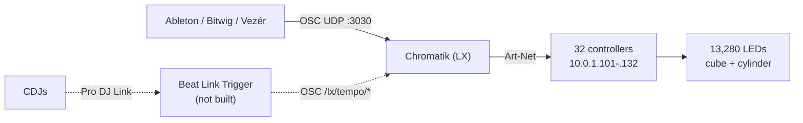

# Lighting Control

All three applications send OSC; Chromatik is the only destination. **Chromatik
receives no audio** — there are no audio-reactive patterns. Open questions live
in [commissioning](commissioning.md).

## The handoff

> **Only one Chromatik may output Art-Net at a time.** Both MacBooks run
> Chromatik and both reach the controllers. Two instances driving the same
> controllers gives an undefined result.

Bringing the live MacBook up:

1. Disable Art-Net output on the **resident** MacBook.
2. Confirm the LEDs have stopped responding to it.
3. Enable output on the **live** MacBook.
4. Verify with a known cue.

Reverse the order coming back. The exact place output is toggled, and how to
verify only one instance is driving, is still to be written down — see
commissioning.

## OSC in

| Setting | Value |
|---|---|
| Receive host | `0.0.0.0` |
| Receive port | `3030` |
| Receive active | `false` in `Apotheneum.lxp`, `true` in `Apotheneum-Test.lxp` |

> **Startup blocker: OSC receive is disabled in the main project as checked in.**
> Either it is enabled by hand every show, or the live show runs a project that
> is not in this repo. Until this is settled there is no reproducible startup
> procedure.

Known addresses:

| Address | Sent by | Meaning |
|---|---|---|
| `/lx/tempo/beat` | Beat Link Trigger | Beat within bar |
| `/lx/tempo/setBPM` | Beat Link Trigger | Tempo |

What Ableton, Bitwig, and Vezér send is not yet recorded. Chromatik derives
addresses from the component hierarchy, so they generally look like
`/lx/mixer/channel/<n>/...`.

## Art-Net out

32 controllers — 20 cube, 12 cylinder — on `10.0.1.0/24`, each with a block of
six universes. Full address and universe table in
[Art-Net destinations](artnet.md).

Each controller carries `Flip` and, on the cylinder, `B2F` (back-to-front) flags
in the fixture definition. These encode physical mounting, so a section
rendering mirrored or upside down is usually one of these being wrong rather than
a wiring fault.

## Planned: CDJ beat sync

Not built. The intent is to drive Chromatik's metronome from live CDJ
performance, using [Beat Link
Trigger](https://github.com/brunchboy/beat-link-trigger) — it joins the Pro DJ
Link network as a virtual CDJ and forwards tempo as OSC to `localhost:3030`.
Chromatik documents this integration, so it is a supported path.

Dependencies before it can be built:

- A second Ethernet port on the live MacBook, keeping Pro DJ Link off the
  Art-Net network
- A decision on which machine runs Beat Link Trigger — `localhost:3030` only
  works if Chromatik is on the same machine
- Chromatik's clock source set to OSC, which makes the CDJs the tempo authority
  and takes it away from the DAWs

Details in the [Chromatik guide](https://chromatik.co/guide/beat-link-trigger/).
