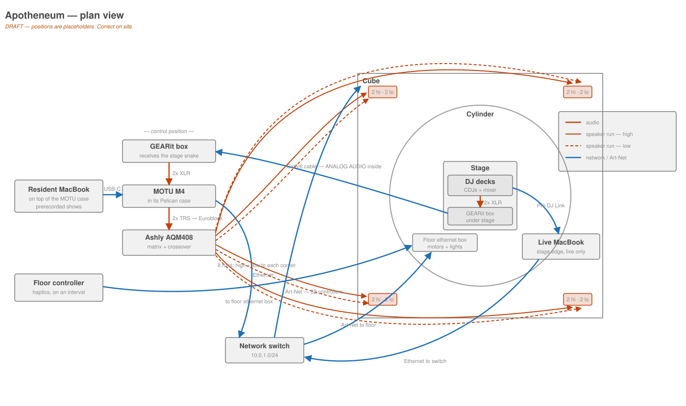

# Physical Installation

**Draft.** Where things are and what plugs into what. **TBD** = unverified.

For how a subsystem works, see [audio](audio-system.md) and
[lighting](lighting-control.md). This page is only *where it is*.

## Layout



**This is a draft — positions are placeholders.** The topology is right; where
things actually sit is not yet confirmed. Corrections welcome, and the file is
plain SVG so it can be edited directly.

Plan view: cube outside, cylinder inside, stage at centre. Speakers at the four
corners, two highs and two lows each — eight runs from the Ashly, one per driver
type. Control position to one side with the receiving GEARit box, network switch
offset from the near corner, live MacBook at the stage edge next to the DJ.

**TBD:** which corner the switch is actually in.
**TBD:** power — where it comes from and how far the run is. Left off the
diagram for now.
**TBD:** actual cable routes — the lines here show what connects to what, not the
path a cable takes.
**TBD:** where the 32 LED controllers physically sit around the structure.

## Pelican cases

**There are two**, and it's worth being precise about which is which.

They are **stacked, and stay stacked** — the MOTU case is always in place on top
of the Ashly case, with the resident MacBook on top of that.

```text
        ┌──────────────────────┐
        │  Resident MacBook    │   sits on the lid
        ├──────────────────────┤
        │  MOTU case (M4)      │   always in place
        ├──────────────────────┤
        │  Ashly case (AQM408) │   rear panel + multipin, see below
        └──────────────────────┘
```

Consequences worth noting: the MacBook is the exposed element of the rig; the
MOTU case must stay closed for it to sit on; and reaching the Ashly means moving
both the machine running the show and the interface above it. Nothing in this
stack is a casual thing to open during a show day.

**TBD:** how the MacBook is secured, if at all.
**TBD:** where the stack sits relative to the stage.
**TBD:** is the MOTU case's rear panelled like the Ashly's, or are the M4's
jacks reachable directly?

### One USB-C cable to the MacBook

**A single USB-C cable runs from the case to the resident MacBook.** That one
cable is the machine's entire physical connection to the installation.

There is an **Ethernet port on the back of the MOTU case**, which the MacBook has
no way to reach directly — so the case must contain a **USB hub or dock** that
the M4 and the Ethernet port both hang off.

```text
     Resident MacBook
           │
           │  ONE USB-C cable
           ▼
    ┌──────────────────────────┐
    │  MOTU case               │
    │   hub/dock ──▶ MOTU M4   │  audio
    │        └────▶ Ethernet ──┼──▶ switch
    └──────────────────────────┘
```

**Inferred, not confirmed:** the internal hub. It follows from a USB-C-only
MacBook connection plus a panel Ethernet port, but nobody has opened the case to
look.

Why this is worth writing down: **audio and network share one cable and one
hub.** A failure there takes out the PA feed and Art-Net output together, which
looks like two unrelated faults at once and invites troubleshooting in the wrong
place. It also means a spare USB-C cable is worth more than its price suggests.

**The hub is powered** — it runs from AC, not from the MacBook's bus. That
removes the usual suspect for intermittent dropouts on a chain like this, and it
means the hub keeps its downstream devices alive independently of the laptop.

**TBD:** what the hub/dock actually is — make and model.
**TBD:** does the MacBook charge over this same USB-C cable? A powered hub
usually delivers power back over USB-C PD, which would make the one cable
data + audio + charging. Worth confirming, because it changes what unplugging
the laptop actually does.
**TBD:** the USB-C cable's spec. Not all USB-C cables carry data at the same
rate, and a charge-only cable would fail in a confusing way.
**TBD:** is there a spare?

### The rear panel hides the Ashly's own connectors

**The AQM408's rear panel is not accessible from outside the case.** A panel on
the back of the Pelican covers it. Connection to the outside world is through a
**panel-mount connector** that plugs in and also seals the opening against dust.

```text
outside            case rear panel              inside
  │                      │                        │
  ├── field cable ──▶ [panel connector] ──▶ internal loom ──▶ AQM408 Euroblock outputs
                     (also the dust seal)
```

**Believed, not confirmed:** that the panel connector lands internally on a
single multipin plug which then breaks out to the Ashly's Euroblock outputs.

This matters more than it looks:

- The **Euroblock outputs are not the service point.** Anything about
  "8 balanced Euroblock outputs" in the [audio doc](audio-system.md) describes
  the device, not what you can reach with the case closed.
- The panel connector and its mating field cable are **single points of failure
  for all eight outputs at once**. A spare matters more here than for any
  individual speaker cable.
- Removing the panel to work on the Ashly **opens the case to dust**, so it isn't
  a casual operation on site.

**TBD:** what the connector actually is — make, series, pin count. Candidates in
this role are typically multipin types (Socapex, Harting, EDAC, or a DB25-style
breakout), but this needs to be read off the part rather than guessed.
**TBD:** the internal pinout — which pin carries which AQM408 output.
**TBD:** is there a spare mating cable? Where is it kept?
**TBD:** how the MOTU → Ashly cable travels between the two cases — through the
panel connector, or its own route?
**TBD:** photograph the case rear panel, the connector, and the internal loom.

### Also in the cases

**TBD:** what else lives in either case — power distribution, a network switch,
ventilation, and whether they run closed.

## Cable runs

| Run | From | To | Notes |
|---|---|---|---|
| Analog audio snake | GEARit box under stage | GEARit box at MOTU | Cat5/6 carrying **analog audio, not network**. **TBD** length and route |
| Pro DJ Link | Stage | Live MacBook | Separate Cat5/6, real network. **TBD** route |
| Speaker outputs | Pelican panel connector | 4 corners | 8 circuits through one multipin. **TBD** breakout location |
| LED network | Switch | 32 controllers | **TBD** switch location, model, port count |
| Live MacBook uplink | Live MacBook Ethernet | Switch | Its only connection to the system |
| Resident MacBook | MacBook | MOTU case | **One USB-C cable** — carries audio and network both |
| Resident MacBook uplink | MOTU case Ethernet port | Switch | Fed by the internal hub |

### The switch

A network switch ties the whole system together. The **live MacBook connects to
it over Ethernet and nothing else** — it has no audio path, no connection to the
MOTU, and no connection to the Ashly. Its entire participation in the show is
Art-Net over that one link.

**TBD:** switch make, model, port count, and where it physically sits.
**TBD:** what else is on it — the AQM408's control port, the resident MacBook,
the 32 LED controllers, and the haptics box are all candidates.
**TBD:** what serves DHCP on `10.0.1.0/24`, if anything.

**Labelling:** the two Cat5/6 runs from stage look identical and carry entirely
different things. Both ends of both should be labelled.

## Power

Everything in the case runs from AC — the powered USB hub included. There is an
AC adapter that the case's contents plug into.

**TBD:** what the AC adapter / distribution actually is, and its capacity.
**TBD:** how many AC feeds the rig needs in total, and from where.
**TBD:** what's on which circuit, and total draw.
**TBD:** are the QSC boxes locally powered at each corner?
**TBD:** anything on UPS? A power blip currently takes down the whole show.

## Photos needed

- Ashly case rear panel, and the panel connector
- MOTU case with the MacBook in position, and the single USB-C cable
- MOTU case rear panel — the Ethernet port
- Inside the MOTU case: the hub/dock and how the M4 and Ethernet hang off it
- Internal loom from the connector to the AQM408
- AQM408 rear as wired
- Inside both cases, lids open
- Stage-end GEARit box with both Cat5 runs
- MOTU front panel in prerecorded and live-DJ states
- Both ends of the MOTU → Ashly cable
